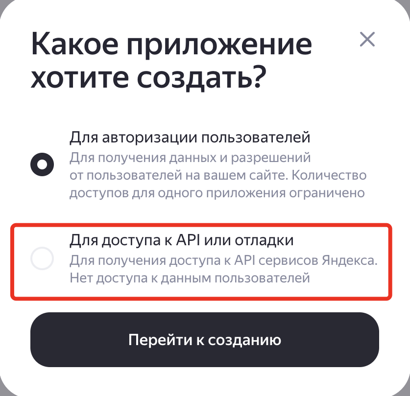

# Синхронизация департаментов пользователей между Active Directory и Yandex 360

## Обзор

Скрипт `sync_deps_for_users.py` предназначен для синхронизации информации о департаментах пользователей между Active Directory (AD) и Yandex 360. Он извлекает данные о пользователях и их департаментах из AD через LDAP, сравнивает их с департаментами в Yandex 360 и обновляет данные в Yandex 360, если необходимо. Скрипт поддерживает режим "сухого прогона" (`DRY_RUN`) для тестирования без внесения изменений.

## Логика работы

1. **Чтение данных из Active Directory**:
   - Подключается к AD через LDAP или LDAPS (шифрованное соединение), используя параметры из файла `.env_ldap` (хост, порт, учётная запись, базовый DN, фильтр поиска).
   - Поддерживает кодировки UTF-8 и KOI8-R для корректной обработки кириллических символов.
   - Запрашивает атрибуты пользователей (`mail`, `department`, `company`) для пользователей, соответствующих фильтру (например, членов группы `Yandex360`).
   - Формирует словарь `{alias: "департамент"}` или `{alias: "департамент (компания)"}` в зависимости от параметра `USE_COMPANY`:
     - Если `USE_COMPANY=true`: формирует `"департамент (компания)"` при наличии обоих атрибутов, или только `"департамент"` при наличии только `department`.
     - Если `USE_COMPANY=false`: формирует только `"департамент"` из атрибута `department`, игнорируя `company`.
   - Сохраняет результаты в CSV-файл, если указан `AD_DEPS_OUT_FILE`.

2. **Получение данных из Yandex 360**:
   - Использует API Yandex 360 для получения списка департаментов и пользователей.
   - Формирует словарь департаментов `{id: название}` и словарь пользователей `{alias: departmentId}`.

3. **Сравнение и синхронизация**:
   - Сравнивает список департаментов из AD с департаментами в Yandex 360 в обе стороны:
     - Выявляет департаменты, которые есть в AD, но отсутствуют в Yandex 360.
     - Выявляет департаменты, которые есть в Yandex 360, но отсутствуют в AD (логируется для информации).
   - Добавляет новые департаменты из AD в Yandex 360 (если они отсутствуют), если `DRY_RUN=false`. Все новые департаменты создаются как дочерние корневого департамента (`parentId=1`).
   - Для каждого пользователя в Yandex 360 проверяет, совпадает ли его департамент с данными из AD:
     - Сопоставление пользователей происходит по основному email (nickname) и по псевдонимам (aliases) из контактов пользователя.
     - Если департамент отличается, обновляет `departmentId` пользователя в Yandex 360 через API (если `DRY_RUN=false`).
     - Если департамент в AD пустой, переводит пользователя в корневой департамент (`departmentId=1`).
   - Проверяет псевдонимы (aliases) пользователей из контактов типа `email`, если их основной email отсутствует в AD, и синхронизирует департаменты по псевдониму.

4. **Логирование**:
   - Логирует операции в консоль (уровень INFO) и в файл `sync_deps.log` (уровень DEBUG).
   - Ротация логов происходит при достижении 10 МБ, хранится до 20 резервных копий.

## Параметры

Скрипт использует переменные окружения, задаваемые в файле `.env_ldap` в каталоге скрипта или непосредственно в окружении:

| Имя параметра         | Описание                                                                 | Обязательный | Пример значения                                    |
|-----------------------|--------------------------------------------------------------------------|--------------|---------------------------------------------------|
| `token`               | OAuth-токен для аутентификации в API Yandex 360.                         | Да           | `y0_AgAAAA...`                                   |
| `orgId`               | Идентификатор организации в Yandex 360 (целочисленный).                  | Да           | `123456`                                          |
| `LDAP_HOST`           | Адрес контроллера домена (DNS-имя или IP).                               | Да           | `dc01.contoso.com`                                |
| `LDAPS_ENABLED`       | Использовать ли LDAPS (шифрованное соединение). Если `True`, порт должен быть 636. | Нет (по умолчанию `False`) | `True` или `False` |
| `LDAP_PORT`           | TCP-порт LDAP (389 для LDAP, 3268 для глобального каталога, 636 для LDAPS). | Да           | `3268` или `636` (для LDAPS)                      |
| `LDAP_USER`           | Учётная запись для подключения к LDAP (формат: `domain\user`).           | Да           | `contoso\ldap_connector`                          |
| `LDAP_PASSWORD`       | Пароль учётной записи LDAP.                                              | Да           | `password`                                        |
| `LDAP_BASE_DN`        | Базовый DN для поиска пользователей в AD.                                | Да           | `OU=Office,DC=contoso,DC=com`                     |
| `LDAP_SEARCH_FILTER`  | Фильтр поиска пользователей в AD.                                        | Да           | `(memberOf=CN=Yandex360,OU=Groups,OU=Office,DC=contoso,DC=com)` |
| `ATTRIB_LIST`         | Список атрибутов для извлечения из AD (через запятую).                   | Да           | `distinguishedName,mail,displayName,department,company` |
| `AD_DEPS_OUT_FILE`    | Имя файла для сохранения результатов LDAP-запроса (CSV).                 | Нет          | `ad_users.csv`                                    |
| `DRY_RUN`             | Режим "сухого прогона" (`true` для имитации, `false` для изменений).     | Нет (по умолчанию `false`) | `true` или `false` |
| `USE_COMPANY`         | Использовать ли атрибут `company` при формировании значения департамента. | Нет (по умолчанию `True`) | `True` или `False` |

### Примечания к параметрам
- **Обязательные параметры**: Все, кроме `AD_DEPS_OUT_FILE`, `DRY_RUN`, `LDAPS_ENABLED` и `USE_COMPANY`, должны быть заданы. При их отсутствии скрипт завершится с ошибкой.
- **LDAP_HOST**: Для нескольких доменов в AD требуется DNS-имя и настройка DNS-разрешения. Для одного домена можно указать IP.
- **LDAPS_ENABLED**: Если установлено в `True`, используется шифрованное соединение LDAPS. В этом случае `LDAP_PORT` должен быть `636`. Для LDAPS требуется наличие валидного SSL-сертификата на сервере LDAP.
- **LDAP_PORT**: 
  - Для обычного LDAP: `389` (стандартный порт) или `3268` (глобальный каталог, рекомендуется для много-доменных лесов).
  - Для LDAPS: `636` (обязательно при `LDAPS_ENABLED=True`).
- **ATTRIB_LIST**: Должен включать как минимум `mail`, `department`, `company` для корректной работы. Рекомендуется также включить `distinguishedName` и `displayName` для отладки.
- **USE_COMPANY**: 
  - Если `True`: департамент формируется как `"департамент (компания)"` при наличии обоих атрибутов, или только `"департамент"` при наличии только `department`.
  - Если `False`: департамент формируется только из атрибута `department`, атрибут `company` игнорируется.
- **DRY_RUN**: Если `true` или `1`, скрипт только логирует предполагаемые изменения без их применения. Рекомендуется использовать для тестирования перед реальной синхронизацией.
- **AD_DEPS_OUT_FILE**: Если указан, результаты LDAP-запроса сохраняются в CSV-файл в формате `alias;department (company)`.
- **Файл `.env_ldap`**: Пример:
  ```
  token = y0_AgAAAA...
  orgId = 123456
  
  LDAP_HOST = dc01.contoso.com
  LDAPS_ENABLED = False
  LDAP_PORT = 3268
  LDAP_USER = contoso\ldap_connector
  LDAP_PASSWORD = password
  LDAP_BASE_DN = OU=Office,DC=contoso,DC=com
  LDAP_SEARCH_FILTER = (memberOf=CN=Yandex360,OU=Groups,OU=Office,DC=contoso,DC=com)
  ATTRIB_LIST = distinguishedName,mail,displayName,company,department
  
  AD_DEPS_OUT_FILE = ad_users.csv
  DRY_RUN = False
  USE_COMPANY = True
  ```

## Подготовка.

### Получение токена Яндекс 360 API

#### Настройка OAuth приложения

1. Для использования приложения необходимо сгенерировать OAuth токен для аутентификации в Yandex 360 API. Токен должен содержать необходимые права для выполнения операций управления ресурсами в организации Yandex 360. Документация - [Создание приложения](https://yandex.ru/dev/id/doc/ru/register-client).

Последовательность шагов для создания токена:
* перейдите на https://oauth.yandex.ru/. Аутентифицируйтесь от имени администратора организации Yandex 360.
* Нажмите на кнопку "Создать".
* В предлагаемом окне выберите "Для доступа к API или отладке" и нажмите "Перейти к созданию".



* заполните поля в форме создания приложения:
  - поле "Название вашего сервиса" - любое название
  - проверьте почту для связи

* добавьте разрешения для токена. Для этого в разделе "Доступ к данным" найдите и добавьте следующие разрешения:

| Имя разрешения | Что можно делать |
|----------------|----------|
| directory:read_departments | читать информацию о  подразделениях |
| directory:write_departments | изменять информацию о подразделениях |
| directory:read_users |  читать информацию о пользователях |
| directory:write_users | изменять информацию о пользователях |


* нажмите кнопку "Создать приложение"
* закройте окно с предложением пройти верификацию через Госуслуги
* в новом окне "Мои приложения" отображаются свойства созданного приложения. Найдите раздел с ID созданного приложения и скопируйте строку из поля "ClientID":


* в текстовом редакторе создайте строку вида `https://oauth.yandex.ru/authorize?response_type=token&client_id=<ID приложения>` и вставьте скопированное значение ClientID из предыдущего шага вместо `<ID приложения>`

Вставьте получившуюся ссылку в браузер и нажмите "Enter".
* в окне браузера появляется запрос на подтверждение прав токена. Подтверждение **должно выполняться с аккаунта администратора организации** (если это сделать от имени обычного пользователя, токен не получит запрашиваемые права из-за отсутствия необходимых разрешений у данного пользовательского аккаунта).
Нажмите "Войти как" и получите необходимый токен доступа.

> [!WARNING]
> Скопируйте токен и сохраните его в безопасном месте.

2. Получите ID организации в Yandex 360. Для этого перейдите в [консоль администрирования](admin.yandex.ru) и в левом нижнем углу интерфейса будет необходимый номер.


3. Запишите полученные на предыдущем шаге OAuth токен и Org ID в соответствующие переменные в файле `.env_ldap` в том же каталоге, что и сами скрипты.

Подробные инструкции по получению токенов см. в [документации Yandex 360](https://yandex.ru/dev/api360/doc/ru/).
        
## Установка

1. **Установите Python**: Требуется Python 3.7 или выше.
2. **Установите зависимости**:
   Скрипт требует библиотеки:
   - `python-dotenv`: Для загрузки переменных окружения.
   - `ldap3`: Для работы с LDAP.
   - `requests`: Для запросов к API Yandex 360 (предполагается, что используется в `API360`).

   Установите их с помощью:
   ```bash
   pip install python-dotenv ldap3 requests aiohttp
   ```
   или
      ```bash
   pip install -r requirements.txt
   ```

3. **Настройте окружение**:
   - Создайте файл `.env_ldap` в каталоге скрипта с параметрами (см. пример выше).
   - Убедитесь, что у вас есть действующий OAuth-токен для Yandex 360, ID организации и учётная запись LDAP с правами чтения AD.

## Запуск

1. **Подготовка**:
   - Поместите скрипт `sync_deps_for_users.py` в рабочий каталог.
   - Создайте и заполните файл `.env_ldap` или задайте переменные окружения.
   - Убедитесь, что файл `lib/y360_api/api_script.py` с классом `API360` доступен.

2. **Запуск скрипта**:
   ```bash
   python sync_deps_for_users.py
   ```
   Скрипт:
   - Подключится к AD (через LDAP или LDAPS) и Yandex 360.
   - Сравнит департаменты и обновит данные в Yandex 360 (если `DRY_RUN=false`).
   - Запишет результаты в лог `sync_deps.log` и, если указан `AD_DEPS_OUT_FILE`, в CSV-файл.

3. **Режим сухого прогона**:
   - Установите `DRY_RUN=true` в `.env_ldap` для тестирования без изменений:
     ```bash
     export DRY_RUN=true
     python sync_deps_for_users.py
     ```

4. **Пример работы**:
   - Скрипт извлечёт пользователей из AD, например, `{ "user_alias": "IT (Contoso Inc)" }` (если `USE_COMPANY=True`) или `{ "user_alias": "IT" }` (если `USE_COMPANY=False`).
   - Проверит департаменты в Yandex 360, добавит отсутствующие (например, "IT (Contoso Inc)").
   - Обновит `departmentId` для пользователей, чьи департаменты не совпадают, или переместит в корневой департамент, если `department` пустой.
   - Выведет информацию о департаментах, которые есть в Yandex 360, но отсутствуют в AD (для справки).

## Логирование

- **Консоль**: Сообщения уровня INFO (например, `2023-10-01 12:00:00.123 INFO: Получен список пользователей AD: 50`).
- **Файл**: Сообщения уровня DEBUG записываются в `sync_deps.log`, ротация при 10 МБ (20 копий).
- Формат: `%(asctime)s.%(msecs)03d %(levelname)s:\t%(message)s` с датой `ГГГГ-ММ-ДД ЧЧ:ММ:СС`.

## Обработка ошибок

- **LDAP-ошибки**: Ошибки подключения или поиска логируются, скрипт завершается.
- **API-ошибки**: Предполагается, что `API360` обрабатывает ошибки; общие исключения логируются.
- **Пустые списки**: Если списки пользователей или департаментов пусты, скрипт завершается с соответствующим сообщением.
- **Отсутствующие пользователи**: Пользователи Yandex 360, отсутствующие в AD, проверяются по псевдонимам.

## Возможности скрипта

- **Поддержка LDAP и LDAPS**: Возможность использования как обычного LDAP, так и шифрованного LDAPS для безопасного подключения к Active Directory.
- **Гибкое формирование департаментов**: Параметр `USE_COMPANY` позволяет выбирать, включать ли название компании в название департамента.
- **Сопоставление по псевдонимам**: Скрипт проверяет не только основной email пользователя, но и его псевдонимы (aliases) из контактов для корректного сопоставления пользователей между AD и Yandex 360.
- **Двустороннее сравнение департаментов**: Выявляет департаменты, которые есть только в AD или только в Yandex 360, что помогает выявить расхождения.
- **Обработка пустых департаментов**: Автоматически перемещает пользователей с пустым департаментом в AD в корневой департамент Yandex 360.
- **Поддержка кодировок**: Автоматическая обработка кириллических символов через поддержку кодировок UTF-8 и KOI8-R.
- **Детальное логирование**: Логирование всех операций с разными уровнями детализации для консоли и файла.

## Ограничения

- Требуется модуль `API360` из `lib/y360_api/api_script.py` (не предоставлен в коде).
- Поддерживаются только пользователи с заполненным `mail` в AD.
- Формат департамента зависит от параметра `USE_COMPANY`:
  - Если `USE_COMPANY=True`: `"департамент (компания)"` или `"департамент"`.
  - Если `USE_COMPANY=False`: только `"департамент"`.
- Поиск по псевдонимам ограничен доменом основного email (извлекается только часть до символа `@`).
- Все новые департаменты создаются как дочерние корневого департамента (`parentId=1`), иерархия департаментов не поддерживается.
